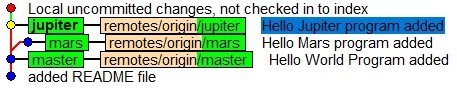
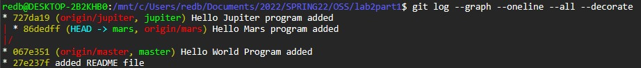
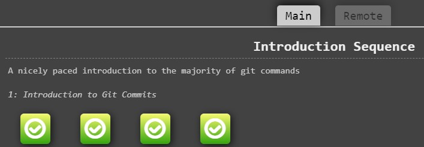
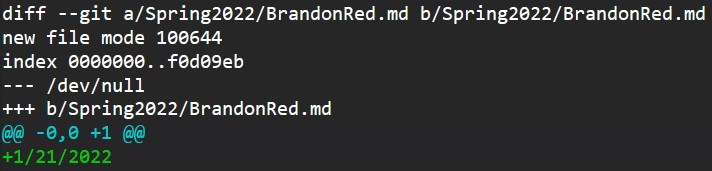
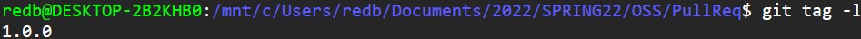

# Lab 02 Report - Git and GitHub Practice  

## Part 1  

["lab2part1" Repository Link](https://github.com/brandon-red/lab2part1/tree/master)  

### Branching Diagrams:

#####  - gitk window:  
     
#####  - git log command line output:
  

## Part 2  

[Forked Repository](https://github.com/brandon-red/Spoon-Knife)

Learn Git Branching Introduction Sequence completion:  

## Part 3  

[My Forked PullReq Repository](https://github.com/brandon-red/PullReq)  

##### - 'git diff' output:  
      

##### - 'git tag -l' output
  

[Common Repository](https://github.com/jportorreal00/OSSProjectIdeas)