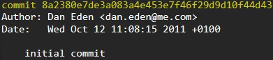
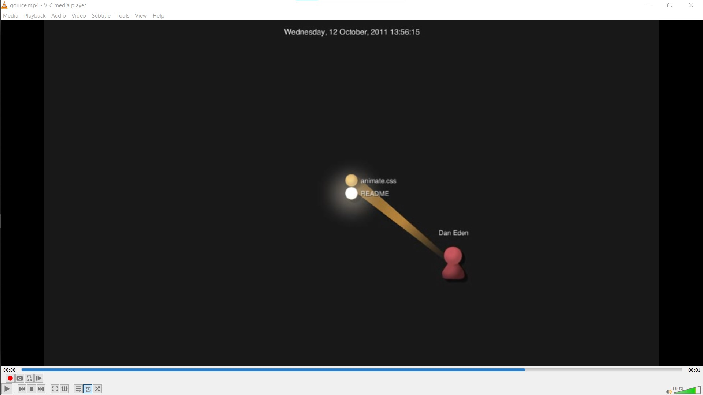
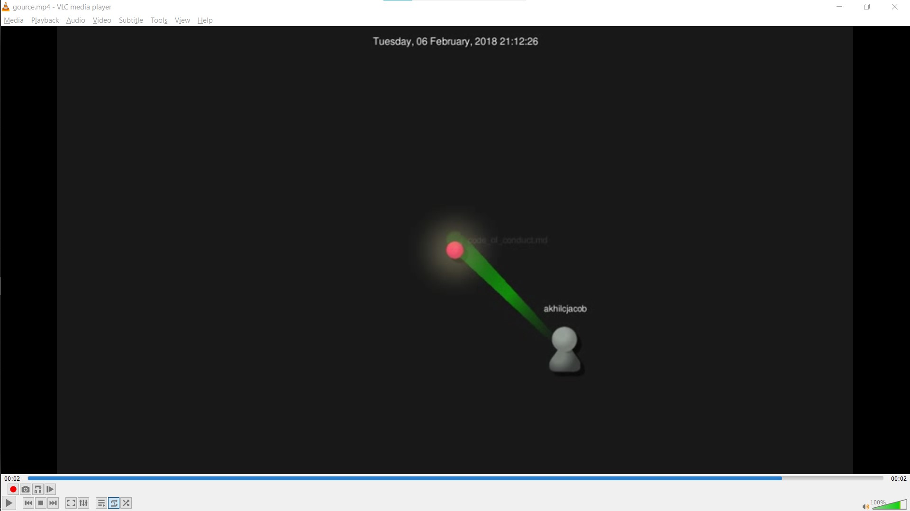

# Lab 03 Report - Community and Documentation

## Part 1

#### [Wiki Page](https://github.com/brandon-red/oss-repo-template/wiki/Project-Ideas)  
  

#### LaTeX Practice
  - Math Equations  
  
  
  -Matrix Representation  
  

## Part 2

#### [Anchor](https://github.com/anchor-site/anchor)  
   
   - 2 Contributors 
   - 4669 lines of code
   - First Commit   
   
   - Latest Commit   
     
   - Current Branches  
      

#### Anchor Gitstats  
       
        

#### Screenshot of gource video    
     

#### [Angel](https://github.com/angel-project/framework)

   - 2 Contributors
   - 784 lines of code  
   - First Commit   
   
   - Latest Commit   
     
   - Current Branches  
     

#### Angel Gitstats  
     
     

#### Screenshot of gource video  
      

#### [Animate.css](https://github.com/colegregory/animate.css)

   - 1 Contributor
   - 3916 lines of code
   - First Commit   
   
   - Latest Commit   
     
   - Current Branches  
     

#### Animate.css Gitstats  
     
       
        

#### Screenshot of gource video  
     

#### [Antimoz](https://github.com/antimoz-om/antimoz)

   - 2 contributors  
   - 1927 lines of code  
   - First Commit   
   
   - Latest Commit   
     
   - Current Branches  
     

#### Antimoz Gitstats  
     
       

#### Screenshot of gource video  
     