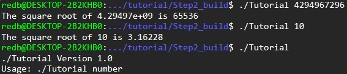
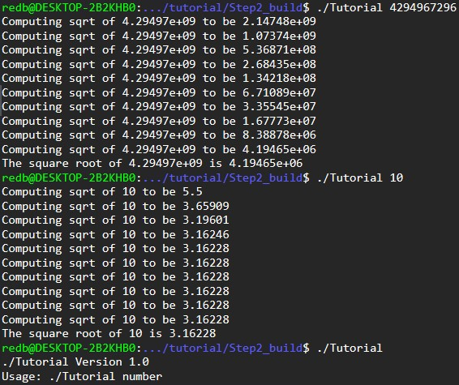
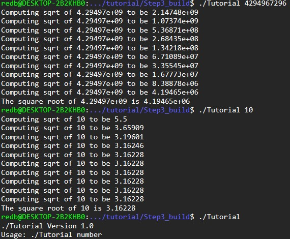
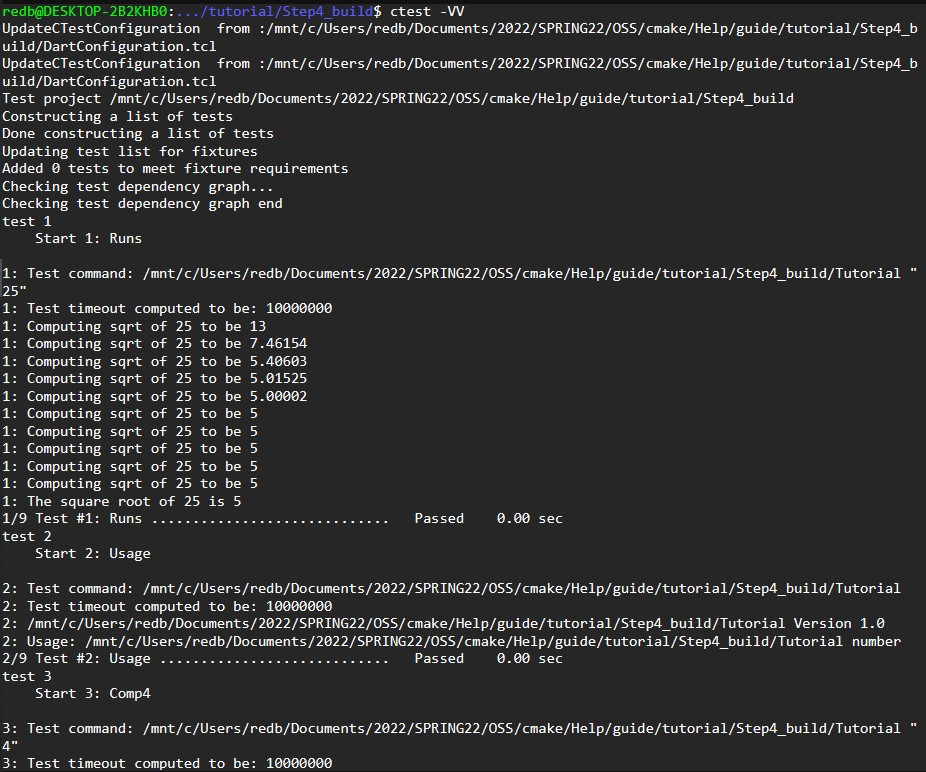
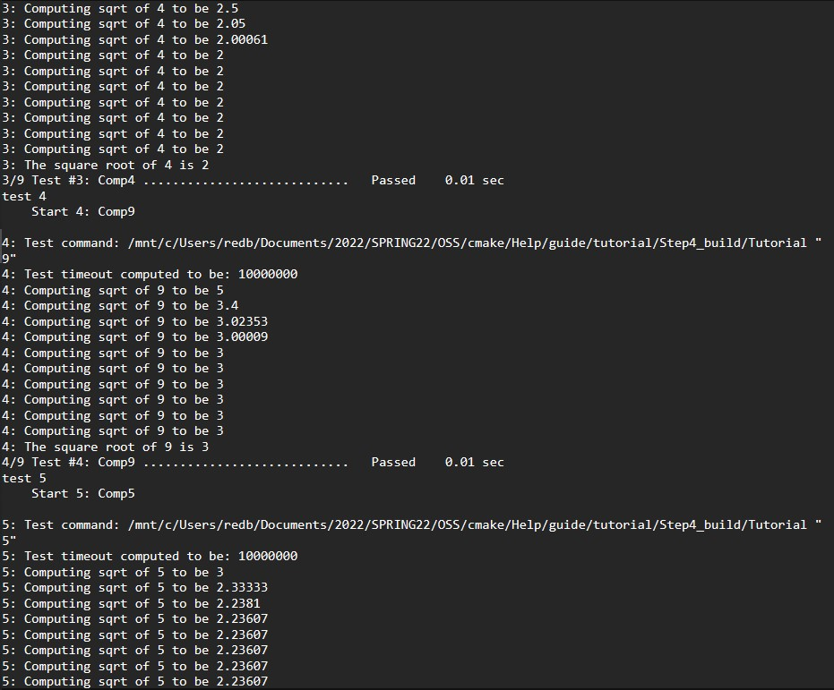
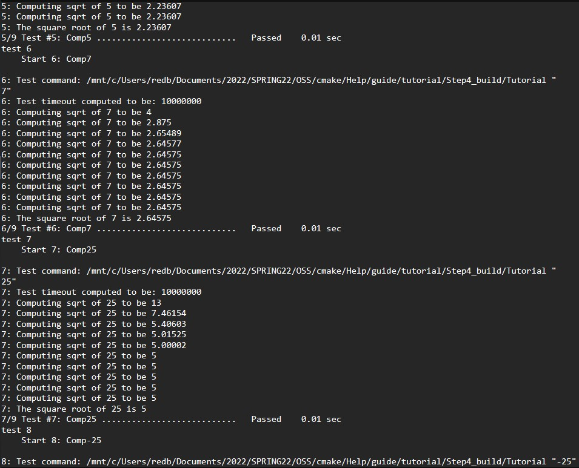
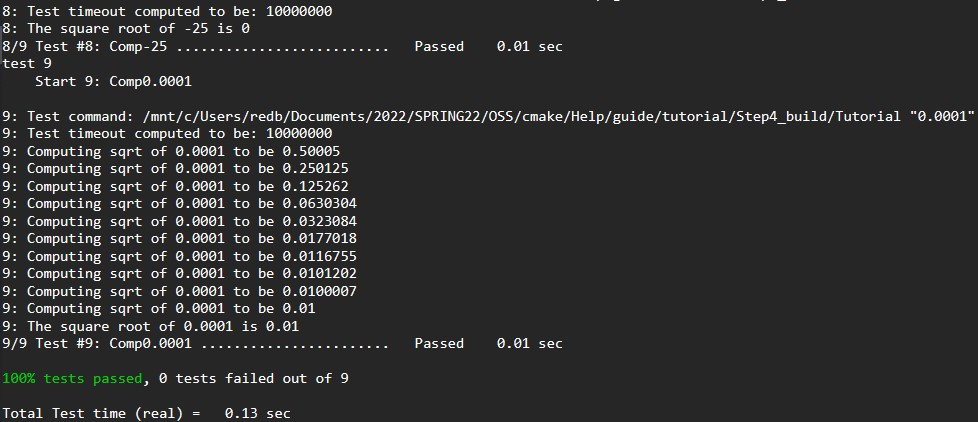
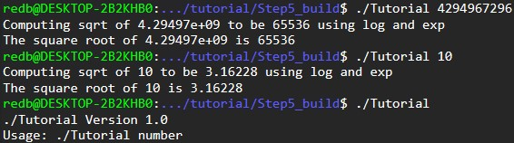
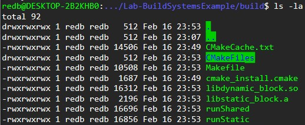
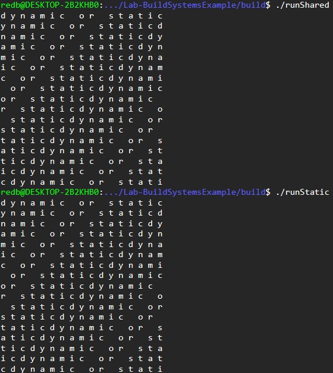

# Lab 05 - Build Systems  

## Step 1 & Step 2  

#### tutorial.cxx  
```cxx  
// A simple program that computes the square root of a number
#include <cmath>
#include <iostream>
#include <string>
#include "TutorialConfig.h"
#ifdef USE_MYMATH
#  include "MathFunctions.h"
#endif

int main(int argc, char* argv[])
{
  if (argc < 2) {
    // report version
    std::cout << argv[0] << " Version " << Tutorial_VERSION_MAJOR << "."
              << Tutorial_VERSION_MINOR << std::endl;
    std::cout << "Usage: " << argv[0] << " number" << std::endl;
    return 1;
  }

  // convert input to double
  const double inputValue = std::stod(argv[1]);

  // calculate square root
  #ifdef USE_MYMATH
    const double outputValue = mysqrt(inputValue);
  #else
    const double outputValue = sqrt(inputValue);
  #endif
  std::cout << "The square root of " << inputValue << " is " << outputValue
            << std::endl;
  return 0;
}

```

#### CMakeLists.txt
```  
cmake_minimum_required(VERSION 3.10)

# set the project name and version
project(Tutorial VERSION 1.0)

# specify the C++ standard
set(CMAKE_CXX_STANDARD 11)
set(CMAKE_CXX_STANDARD_REQUIRED True)

option(USE_MYMATH "Use tutorial provided math implmentation" ON)

# configure a header file to pass some of the CMake settings
# to the source code
configure_file(TutorialConfig.h.in TutorialConfig.h)

if(USE_MYMATH)
	add_subdirectory(MathFunctions)
	list(APPEND EXTRA_LIBS MathFunctions)
	list(APPEND EXTRA_INCLUDES "${PROJECT_SOURCE_DIR}/MathFunctions")
endif()

# add the executable
add_executable(Tutorial tutorial.cxx)

target_link_libraries(Tutorial PUBLIC ${EXTRA_LIBS})

# add the binary tree to the search path for include files
# so that we will find TutorialConfig.h
target_include_directories(Tutorial PUBLIC
                           "${PROJECT_BINARY_DIR}"
                           ${EXTRA_INCLUDES}
                           )
```  
#### Output of tests  

  
    


## Step 3  

#### CMakeLists.txt
```  
cmake_minimum_required(VERSION 3.10)

# set the project name and version
project(Tutorial VERSION 1.0)

# specify the C++ standard
set(CMAKE_CXX_STANDARD 11)
set(CMAKE_CXX_STANDARD_REQUIRED True)

# should we use our own math functions
option(USE_MYMATH "Use tutorial provided math implementation" ON)

# configure a header file to pass some of the CMake settings
# to the source code
configure_file(TutorialConfig.h.in TutorialConfig.h)

# add the MathFunctions library
if(USE_MYMATH)
  add_subdirectory(MathFunctions)
  list(APPEND EXTRA_LIBS MathFunctions)
endif()

# add the executable
add_executable(Tutorial tutorial.cxx)

target_link_libraries(Tutorial PUBLIC ${EXTRA_LIBS})

# add the binary tree to the search path for include files
# so that we will find TutorialConfig.h
target_include_directories(Tutorial PUBLIC
                           "${PROJECT_BINARY_DIR}"
                           )
```  

#### MathFunctions/CMakeLists.txt
```
add_library(MathFunctions mysqrt.cxx)
target_include_directories(MathFunctions
          INTERFACE ${CMAKE_CURRENT_SOURCE_DIR}
          )     
```  

#### Tutorial command outputs  

  

## Step 4  

#### CMakeLists.txt  
```
cmake_minimum_required(VERSION 3.10)

# set the project name and version
project(Tutorial VERSION 1.0)

# specify the C++ standard
set(CMAKE_CXX_STANDARD 11)
set(CMAKE_CXX_STANDARD_REQUIRED True)

# should we use our own math functions
option(USE_MYMATH "Use tutorial provided math implementation" ON)

# configure a header file to pass some of the CMake settings
# to the source code
configure_file(TutorialConfig.h.in TutorialConfig.h)

# add the MathFunctions library
if(USE_MYMATH)
  add_subdirectory(MathFunctions)
  list(APPEND EXTRA_LIBS MathFunctions)
endif()

# add the executable
add_executable(Tutorial tutorial.cxx)

target_link_libraries(Tutorial PUBLIC ${EXTRA_LIBS})

# add the binary tree to the search path for include files
# so that we will find TutorialConfig.h
target_include_directories(Tutorial PUBLIC
                           "${PROJECT_BINARY_DIR}"
                           )
install(TARGETS Tutorial DESTINATION bin)
install(FILES "${PROJECT_BINARY_DIR}/TutorialConfig.h"
  DESTINATION include
  )

enable_testing()

# does the application run
add_test(NAME Runs COMMAND Tutorial 25)

# does the usage message work?
add_test(NAME Usage COMMAND Tutorial)
set_tests_properties(Usage
  PROPERTIES PASS_REGULAR_EXPRESSION "Usage:.*number"
  )

# define a function to simplify adding tests
function(do_test target arg result)
  add_test(NAME Comp${arg} COMMAND ${target} ${arg})
  set_tests_properties(Comp${arg}
    PROPERTIES PASS_REGULAR_EXPRESSION ${result}
    )
endfunction()

# do a bunch of result based tests
do_test(Tutorial 4 "4 is 2")
do_test(Tutorial 9 "9 is 3")
do_test(Tutorial 5 "5 is 2.236")
do_test(Tutorial 7 "7 is 2.645")
do_test(Tutorial 25 "25 is 5")
do_test(Tutorial -25 "-25 is (-nan|nan|0)")
do_test(Tutorial 0.0001 "0.0001 is 0.01")
```
#### MathFunctions/CMakeLists.txt  
```
add_library(MathFunctions mysqrt.cxx)

# state that anybody linking to us needs to include the current source dir
# to find MathFunctions.h, while we don't.
target_include_directories(MathFunctions
          INTERFACE ${CMAKE_CURRENT_SOURCE_DIR}
          )

install(TARGETS MathFunctions DESTINATION lib)
install(FILES MathFunctions.h DESTINATION include)
```
#### output of ```ctest -VV```





## Step 5    

#### CMakeLists.txt  
```
cmake_minimum_required(VERSION 3.10)

# set the project name and version
project(Tutorial VERSION 1.0)

# specify the C++ standard
set(CMAKE_CXX_STANDARD 11)
set(CMAKE_CXX_STANDARD_REQUIRED True)

# should we use our own math functions
option(USE_MYMATH "Use tutorial provided math implementation" ON)

# configure a header file to pass some of the CMake settings
# to the source code
configure_file(TutorialConfig.h.in TutorialConfig.h)

# add the MathFunctions library
if(USE_MYMATH)
  add_subdirectory(MathFunctions)
  list(APPEND EXTRA_LIBS MathFunctions)
endif()

# add the executable
add_executable(Tutorial tutorial.cxx)
target_link_libraries(Tutorial PUBLIC ${EXTRA_LIBS})

# add the binary tree to the search path for include files
# so that we will find TutorialConfig.h
target_include_directories(Tutorial PUBLIC
                           "${PROJECT_BINARY_DIR}"
                           )

# add the install targets
install(TARGETS Tutorial DESTINATION bin)
install(FILES "${PROJECT_BINARY_DIR}/TutorialConfig.h"
  DESTINATION include
  )

# enable testing
enable_testing()

# does the application run
add_test(NAME Runs COMMAND Tutorial 25)

# does the usage message work?
add_test(NAME Usage COMMAND Tutorial)
set_tests_properties(Usage
  PROPERTIES PASS_REGULAR_EXPRESSION "Usage:.*number"
  )

# define a function to simplify adding tests
function(do_test target arg result)
  add_test(NAME Comp${arg} COMMAND ${target} ${arg})
  set_tests_properties(Comp${arg}
    PROPERTIES PASS_REGULAR_EXPRESSION ${result}
    )
endfunction()

# do a bunch of result based tests
do_test(Tutorial 4 "4 is 2")
do_test(Tutorial 9 "9 is 3")
do_test(Tutorial 5 "5 is 2.236")
do_test(Tutorial 7 "7 is 2.645")
do_test(Tutorial 25 "25 is 5")
do_test(Tutorial -25 "-25 is (-nan|nan|0)")
do_test(Tutorial 0.0001 "0.0001 is 0.01")
```
#### MathFunctions/CMakeLists.txt  
```
add_library(MathFunctions mysqrt.cxx)

# state that anybody linking to us needs to include the current source dir
# to find MathFunctions.h, while we don't.
target_include_directories(MathFunctions
          INTERFACE ${CMAKE_CURRENT_SOURCE_DIR}
          )

# does this system provide the log and exp functions?
include(CheckSymbolExists)
check_symbol_exists(log "math.h" HAVE_LOG)
check_symbol_exists(exp "math.h" HAVE_EXP)
if(NOT (HAVE_LOG AND HAVE_EXP))
  unset(HAVE_LOG CACHE)
  unset(HAVE_EXP CACHE)
  set(CMAKE_REQUIRED_LIBRARIES "m")
  check_symbol_exists(log "math.h" HAVE_LOG)
  check_symbol_exists(exp "math.h" HAVE_EXP)
  if(HAVE_LOG AND HAVE_EXP)
    target_link_libraries(MathFunctions PRIVATE m)
  endif()
endif()

if(HAVE_LOG AND HAVE_EXP)
  target_compile_definitions(MathFunctions
                             PRIVATE "HAVE_LOG" "HAVE_EXP")
endif()

# install rules
install(TARGETS MathFunctions DESTINATION lib)
install(FILES MathFunctions.h DESTINATION include)
```

#### Running Tutorial for the USE_MYMATH case code  

  

## Build System Example

#### Self-created Makefile
```
all: runStatic runShared
clean:
  rm runStatic runShared program.o static_block.a dynamic_block.so block1.o block2.o
runStatic: program.o static_block.a
  cc program.o static_block.a -o runStatic
runShared: program.o dynamic_block.so
  cc program.o dynamic_block.so -o runShared -Wl,-rpath='$$ORIGIN'
program.o: ../program.c
  cc -c ../program.c -o program.o
static_block.a: block1.o
  ar qc static_block.a block1.o
dynamic_block.so: block2.o
  cc -shared -o dynamic_block.so block2.o
block1.o: block.c
  cc -c block.c -o block1.o
block2.o: block.c
  cc -fPIC -c block.c -o block2.o
```
#### CMakeLists.txt
```
cmake_minimum_required(VERSION 3.10)
# set the project name
project(Block)

add_library(static_block STATIC block.c)
add_library(dynamic_block SHARED block.c)

# add the executable
add_executable(runShared ../program.c)
add_executable(runStatic ../program.c)

target_link_libraries(runStatic PUBLIC static_block)
target_link_libraries(runShared PUBLIC dynamic_block)
```
#### cmake Makefile
```
# CMAKE generated file: DO NOT EDIT!
# Generated by "Unix Makefiles" Generator, CMake Version 3.16

# Default target executed when no arguments are given to make.
default_target: all

.PHONY : default_target

# Allow only one "make -f Makefile2" at a time, but pass parallelism.
.NOTPARALLEL:


#=============================================================================
# Special targets provided by cmake.

# Disable implicit rules so canonical targets will work.
.SUFFIXES:


# Remove some rules from gmake that .SUFFIXES does not remove.
SUFFIXES =

.SUFFIXES: .hpux_make_needs_suffix_list


# Suppress display of executed commands.
$(VERBOSE).SILENT:


# A target that is always out of date.
cmake_force:

.PHONY : cmake_force

#=============================================================================
# Set environment variables for the build.

# The shell in which to execute make rules.
SHELL = /bin/sh

# The CMake executable.
CMAKE_COMMAND = /usr/bin/cmake

# The command to remove a file.
RM = /usr/bin/cmake -E remove -f

# Escaping for special characters.
EQUALS = =

# The top-level source directory on which CMake was run.
CMAKE_SOURCE_DIR = /mnt/c/Users/redb/Documents/2022/SPRING22/OSS/CSCI-4470-OpenSource/Modules/05.BuildSystems/Lab-BuildSystemsExample/source

# The top-level build directory on which CMake was run.
CMAKE_BINARY_DIR = /mnt/c/Users/redb/Documents/2022/SPRING22/OSS/CSCI-4470-OpenSource/Modules/05.BuildSystems/Lab-BuildSystemsExample/build

#=============================================================================
# Targets provided globally by CMake.

# Special rule for the target rebuild_cache
rebuild_cache:
  @$(CMAKE_COMMAND) -E cmake_echo_color --switch=$(COLOR) --cyan "Running CMake to regenerate build system..."
  /usr/bin/cmake -S$(CMAKE_SOURCE_DIR) -B$(CMAKE_BINARY_DIR)
.PHONY : rebuild_cache

# Special rule for the target rebuild_cache
rebuild_cache/fast: rebuild_cache

.PHONY : rebuild_cache/fast

# Special rule for the target edit_cache
edit_cache:
  @$(CMAKE_COMMAND) -E cmake_echo_color --switch=$(COLOR) --cyan "No interactive CMake dialog available..."
  /usr/bin/cmake -E echo No\ interactive\ CMake\ dialog\ available.
.PHONY : edit_cache

# Special rule for the target edit_cache
edit_cache/fast: edit_cache

.PHONY : edit_cache/fast

# The main all target
all: cmake_check_build_system
  $(CMAKE_COMMAND) -E cmake_progress_start /mnt/c/Users/redb/Documents/2022/SPRING22/OSS/CSCI-4470-OpenSource/Modules/05.BuildSystems/Lab-BuildSystemsExample/build/CMakeFiles /mnt/c/Users/redb/Documents/2022/SPRING22/OSS/CSCI-4470-OpenSource/Modules/05.BuildSystems/Lab-BuildSystemsExample/build/CMakeFiles/progress.marks
  $(MAKE) -f CMakeFiles/Makefile2 all
  $(CMAKE_COMMAND) -E cmake_progress_start /mnt/c/Users/redb/Documents/2022/SPRING22/OSS/CSCI-4470-OpenSource/Modules/05.BuildSystems/Lab-BuildSystemsExample/build/CMakeFiles 0
.PHONY : all

# The main clean target
clean:
  $(MAKE) -f CMakeFiles/Makefile2 clean
.PHONY : clean

# The main clean target
clean/fast: clean

.PHONY : clean/fast

# Prepare targets for installation.
preinstall: all
  $(MAKE) -f CMakeFiles/Makefile2 preinstall
.PHONY : preinstall

# Prepare targets for installation.
preinstall/fast:
  $(MAKE) -f CMakeFiles/Makefile2 preinstall
.PHONY : preinstall/fast

# clear depends
depend:
  $(CMAKE_COMMAND) -S$(CMAKE_SOURCE_DIR) -B$(CMAKE_BINARY_DIR) --check-build-system CMakeFiles/Makefile.cmake 1
.PHONY : depend

#=============================================================================
# Target rules for targets named runStatic

# Build rule for target.
runStatic: cmake_check_build_system
  $(MAKE) -f CMakeFiles/Makefile2 runStatic
.PHONY : runStatic

# fast build rule for target.
runStatic/fast:
  $(MAKE) -f CMakeFiles/runStatic.dir/build.make CMakeFiles/runStatic.dir/build
.PHONY : runStatic/fast

#=============================================================================
# Target rules for targets named runShared

# Build rule for target.
runShared: cmake_check_build_system
  $(MAKE) -f CMakeFiles/Makefile2 runShared
.PHONY : runShared

# fast build rule for target.
runShared/fast:
  $(MAKE) -f CMakeFiles/runShared.dir/build.make CMakeFiles/runShared.dir/build
.PHONY : runShared/fast

#=============================================================================
# Target rules for targets named dynamic_block

# Build rule for target.
dynamic_block: cmake_check_build_system
  $(MAKE) -f CMakeFiles/Makefile2 dynamic_block
.PHONY : dynamic_block

# fast build rule for target.
dynamic_block/fast:
  $(MAKE) -f CMakeFiles/dynamic_block.dir/build.make CMakeFiles/dynamic_block.dir/build
.PHONY : dynamic_block/fast

#=============================================================================
# Target rules for targets named static_block

# Build rule for target.
static_block: cmake_check_build_system
  $(MAKE) -f CMakeFiles/Makefile2 static_block
.PHONY : static_block

# fast build rule for target.
static_block/fast:
  $(MAKE) -f CMakeFiles/static_block.dir/build.make CMakeFiles/static_block.dir/build
.PHONY : static_block/fast

block.o: block.c.o

.PHONY : block.o

# target to build an object file
block.c.o:
  $(MAKE) -f CMakeFiles/dynamic_block.dir/build.make CMakeFiles/dynamic_block.dir/block.c.o
  $(MAKE) -f CMakeFiles/static_block.dir/build.make CMakeFiles/static_block.dir/block.c.o
.PHONY : block.c.o

block.i: block.c.i

.PHONY : block.i

# target to preprocess a source file
block.c.i:
  $(MAKE) -f CMakeFiles/dynamic_block.dir/build.make CMakeFiles/dynamic_block.dir/block.c.i
  $(MAKE) -f CMakeFiles/static_block.dir/build.make CMakeFiles/static_block.dir/block.c.i
.PHONY : block.c.i

block.s: block.c.s

.PHONY : block.s

# target to generate assembly for a file
block.c.s:
  $(MAKE) -f CMakeFiles/dynamic_block.dir/build.make CMakeFiles/dynamic_block.dir/block.c.s
  $(MAKE) -f CMakeFiles/static_block.dir/build.make CMakeFiles/static_block.dir/block.c.s
.PHONY : block.c.s

mnt/c/Users/redb/Documents/2022/SPRING22/OSS/CSCI-4470-OpenSource/Modules/05.BuildSystems/Lab-BuildSystemsExample/program.o: mnt/c/Users/redb/Documents/2022/SPRING22/OSS/CSCI-4470-OpenSource/Modules/05.BuildSystems/Lab-BuildSystemsExample/program.c.o

.PHONY : mnt/c/Users/redb/Documents/2022/SPRING22/OSS/CSCI-4470-OpenSource/Modules/05.BuildSystems/Lab-BuildSystemsExample/program.o

# target to build an object file
mnt/c/Users/redb/Documents/2022/SPRING22/OSS/CSCI-4470-OpenSource/Modules/05.BuildSystems/Lab-BuildSystemsExample/program.c.o:
  $(MAKE) -f CMakeFiles/runStatic.dir/build.make CMakeFiles/runStatic.dir/mnt/c/Users/redb/Documents/2022/SPRING22/OSS/CSCI-4470-OpenSource/Modules/05.BuildSystems/Lab-BuildSystemsExample/program.c.o
  $(MAKE) -f CMakeFiles/runShared.dir/build.make CMakeFiles/runShared.dir/mnt/c/Users/redb/Documents/2022/SPRING22/OSS/CSCI-4470-OpenSource/Modules/05.BuildSystems/Lab-BuildSystemsExample/program.c.o
.PHONY : mnt/c/Users/redb/Documents/2022/SPRING22/OSS/CSCI-4470-OpenSource/Modules/05.BuildSystems/Lab-BuildSystemsExample/program.c.o

mnt/c/Users/redb/Documents/2022/SPRING22/OSS/CSCI-4470-OpenSource/Modules/05.BuildSystems/Lab-BuildSystemsExample/program.i: mnt/c/Users/redb/Documents/2022/SPRING22/OSS/CSCI-4470-OpenSource/Modules/05.BuildSystems/Lab-BuildSystemsExample/program.c.i

.PHONY : mnt/c/Users/redb/Documents/2022/SPRING22/OSS/CSCI-4470-OpenSource/Modules/05.BuildSystems/Lab-BuildSystemsExample/program.i

# target to preprocess a source file
mnt/c/Users/redb/Documents/2022/SPRING22/OSS/CSCI-4470-OpenSource/Modules/05.BuildSystems/Lab-BuildSystemsExample/program.c.i:
  $(MAKE) -f CMakeFiles/runStatic.dir/build.make CMakeFiles/runStatic.dir/mnt/c/Users/redb/Documents/2022/SPRING22/OSS/CSCI-4470-OpenSource/Modules/05.BuildSystems/Lab-BuildSystemsExample/program.c.i
  $(MAKE) -f CMakeFiles/runShared.dir/build.make CMakeFiles/runShared.dir/mnt/c/Users/redb/Documents/2022/SPRING22/OSS/CSCI-4470-OpenSource/Modules/05.BuildSystems/Lab-BuildSystemsExample/program.c.i
.PHONY : mnt/c/Users/redb/Documents/2022/SPRING22/OSS/CSCI-4470-OpenSource/Modules/05.BuildSystems/Lab-BuildSystemsExample/program.c.i

mnt/c/Users/redb/Documents/2022/SPRING22/OSS/CSCI-4470-OpenSource/Modules/05.BuildSystems/Lab-BuildSystemsExample/program.s: mnt/c/Users/redb/Documents/2022/SPRING22/OSS/CSCI-4470-OpenSource/Modules/05.BuildSystems/Lab-BuildSystemsExample/program.c.s

.PHONY : mnt/c/Users/redb/Documents/2022/SPRING22/OSS/CSCI-4470-OpenSource/Modules/05.BuildSystems/Lab-BuildSystemsExample/program.s

# target to generate assembly for a file
mnt/c/Users/redb/Documents/2022/SPRING22/OSS/CSCI-4470-OpenSource/Modules/05.BuildSystems/Lab-BuildSystemsExample/program.c.s:
  $(MAKE) -f CMakeFiles/runStatic.dir/build.make CMakeFiles/runStatic.dir/mnt/c/Users/redb/Documents/2022/SPRING22/OSS/CSCI-4470-OpenSource/Modules/05.BuildSystems/Lab-BuildSystemsExample/program.c.s
  $(MAKE) -f CMakeFiles/runShared.dir/build.make CMakeFiles/runShared.dir/mnt/c/Users/redb/Documents/2022/SPRING22/OSS/CSCI-4470-OpenSource/Modules/05.BuildSystems/Lab-BuildSystemsExample/program.c.s
.PHONY : mnt/c/Users/redb/Documents/2022/SPRING22/OSS/CSCI-4470-OpenSource/Modules/05.BuildSystems/Lab-BuildSystemsExample/program.c.s

# Help Target
help:
  @echo "The following are some of the valid targets for this Makefile:"
  @echo "... all (the default if no target is provided)"
  @echo "... clean"
  @echo "... depend"
  @echo "... rebuild_cache"
  @echo "... edit_cache"
  @echo "... runStatic"
  @echo "... runShared"
  @echo "... dynamic_block"
  @echo "... static_block"
  @echo "... block.o"
  @echo "... block.i"
  @echo "... block.s"
  @echo "... mnt/c/Users/redb/Documents/2022/SPRING22/OSS/CSCI-4470-OpenSource/Modules/05.BuildSystems/Lab-BuildSystemsExample/program.o"
  @echo "... mnt/c/Users/redb/Documents/2022/SPRING22/OSS/CSCI-4470-OpenSource/Modules/05.BuildSystems/Lab-BuildSystemsExample/program.i"
  @echo "... mnt/c/Users/redb/Documents/2022/SPRING22/OSS/CSCI-4470-OpenSource/Modules/05.BuildSystems/Lab-BuildSystemsExample/program.s"
.PHONY : help


#=============================================================================
# Special targets to cleanup operation of make.

# Special rule to run CMake to check the build system integrity.
# No rule that depends on this can have commands that come from listfiles
# because they might be regenerated.
cmake_check_build_system:
  $(CMAKE_COMMAND) -S$(CMAKE_SOURCE_DIR) -B$(CMAKE_BINARY_DIR) --check-build-system CMakeFiles/Makefile.cmake 0
.PHONY : cmake_check_build_system

```
#### size of executables and outputs



