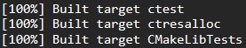
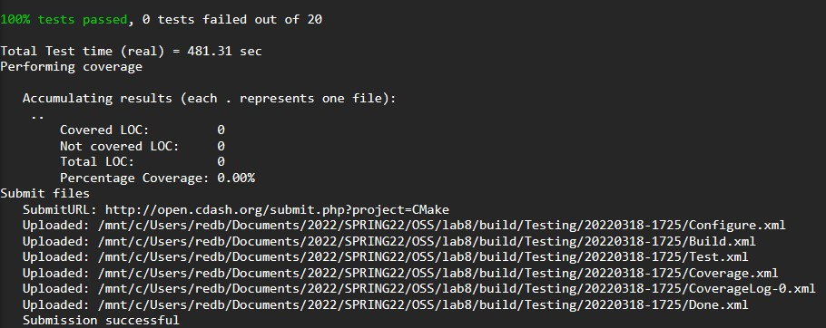
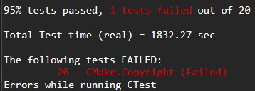
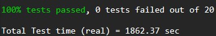
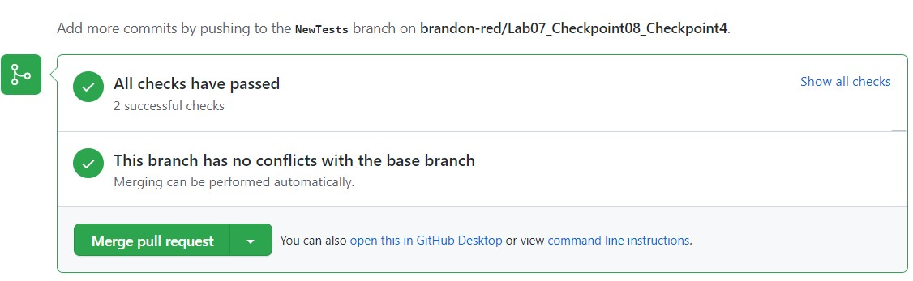
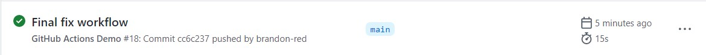

# Lab 07 (Module 08)- Testing and Continuous Integration

### Checkpoint 1

***Command Line Build Completion Output***  


### Checkpoint 2

Find the Nightly and Experimental sections and look at some of the submissions. How can you see what tests were run for a particular submission?

 - To see the tests that were run for a particular submission, you must first click the link under the column "Build Name". After scrolling to the bottom of the page, there is a link to see the "Tests Summary" of the build. From this page, we are able to see all the tests that were run, and the stats for each test such as; Status, Time, Details, History, and Summary.

Find a submission with errors. Can you see what the error condition was? How does this help you debug the failure?

 - Yes, you can see what the error condition was by clicking the link to the failed test. This link will provide information about the test that failed, what file it is in, what line number and the output that the test creates. This will help with debugging so we know where to go and what to fix.

Find a system that is close to your specific configuration in the Nightly, Nightly Expected or one of the Masters sections. How clean is the dashboard? Are there any errors that you need to be concerned with?

 - The dashboard of a configuration similar to mine showed a clean dashboard, there are no errors that I need to be concerned with.

***Command Line Tests Passed Output***


### Checkpoint 3

***Command Line Test Failed Output***  


The command line output did not provide much information, but upon looking at the error in the dashboard, as described by the process I mentioned in the second question earlier, I was able to find the error within the `Copyright.txt` file, the change is seen below.  

***Original***
```
Copyright 2000-2020 Kitware, Inc. and Contributors
```
***Correction***
```
Copyright 2000-2022 Kitware, Inc. and Contributors
```
***Command Line Test Passed Output***   


### Checkpoint 4

[Repository Used for CI Testing](https://github.com/brandon-red/Lab07_Checkpoint08_Checkpoint4)

***Pull Request Successful Tests***  


***Push Successful Tests***  
