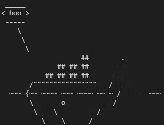
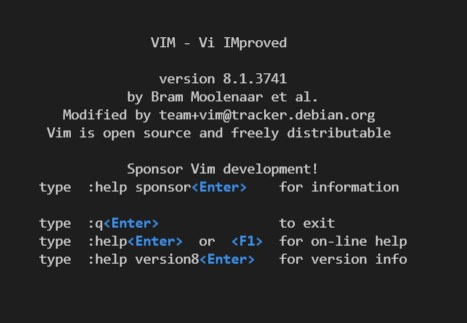
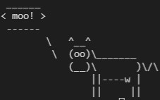
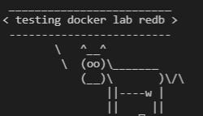
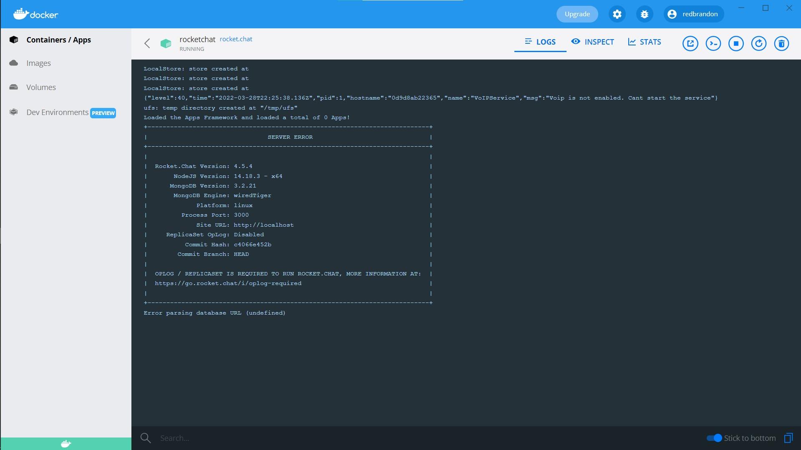

# Lab 08 (Module 09)- Virtualization

### Example 00

After running the command, `docker run docker/whalesay cowsay boo` the following was the output.

### Example 01

***The following images show the running of Ubuntu within a Docker container.***  
The root directory: 

After installing vim:  

`cowsay "moo!"`  

`cowsay "testing docker lab redb"`  

### Example 02

Followed the instructions for RocketChat at the [Rocket.Chat Repo](https://github.com/RocketChat/Docker.Official.Image).

Was unable to get this running at the time of writing this, this log was shown and I was unable to figure out a fix.

### Example 03

After following along with the steps, the following image is the resulting screenshot from the web server.

### Example 04
