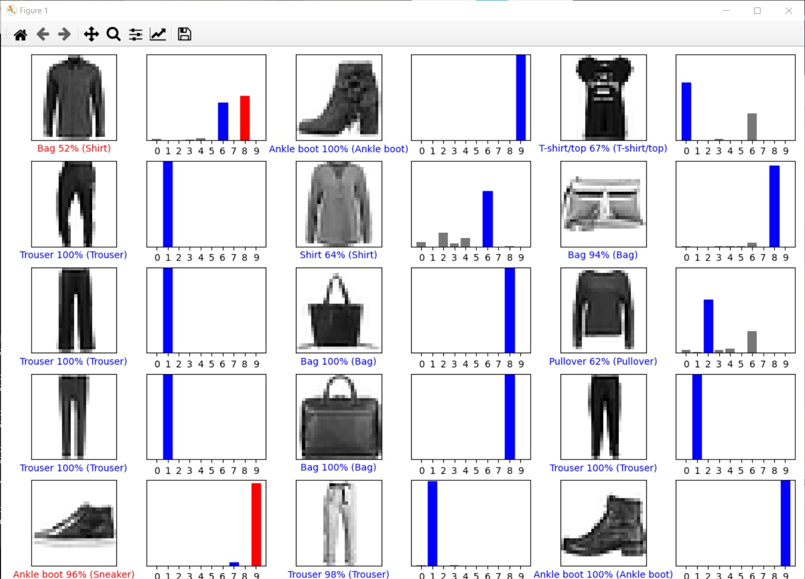
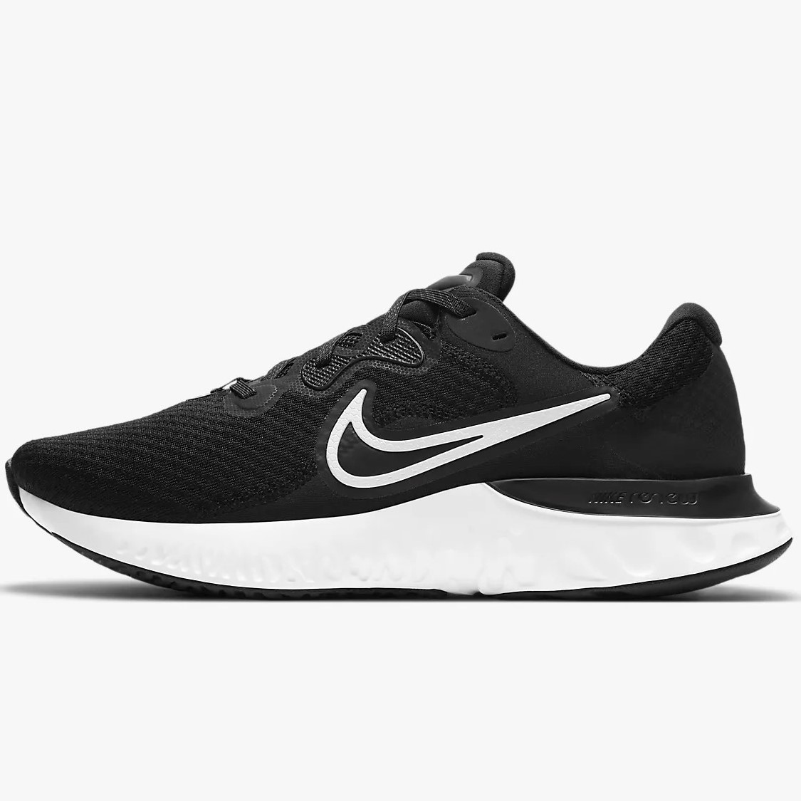
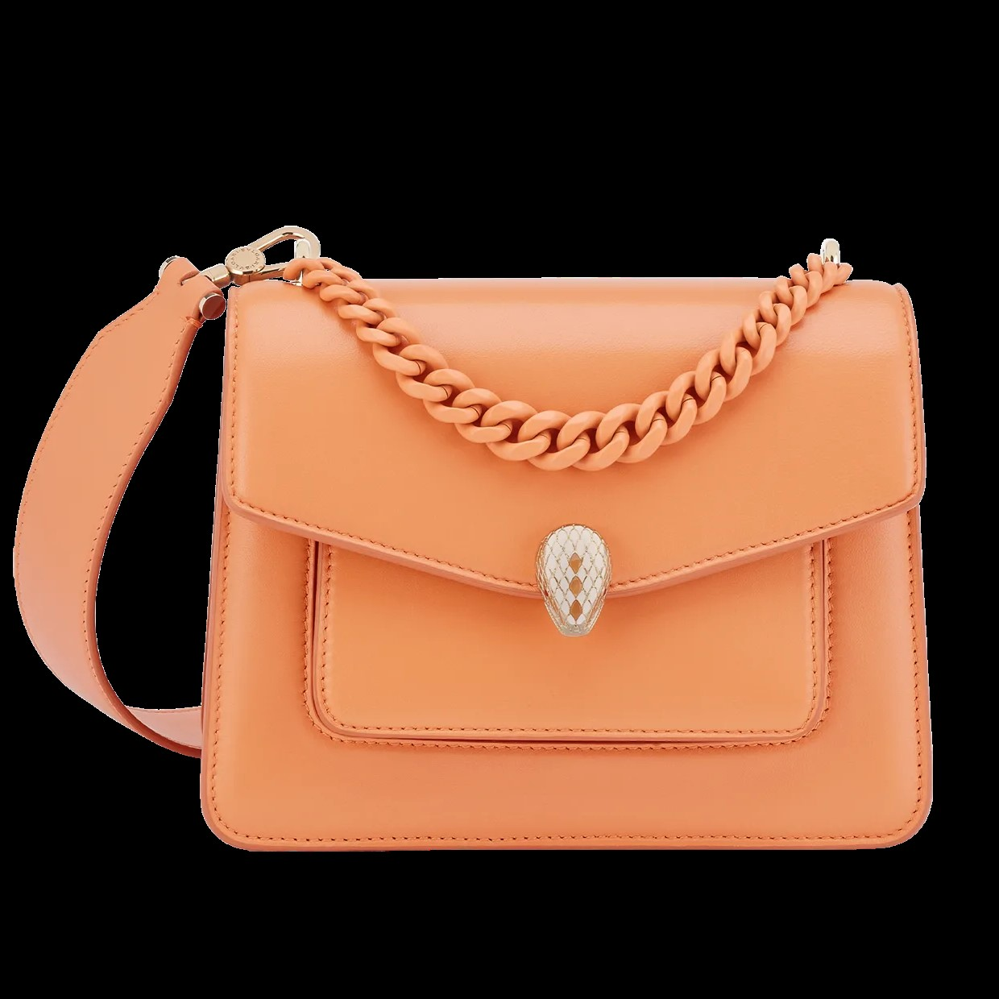
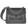
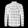
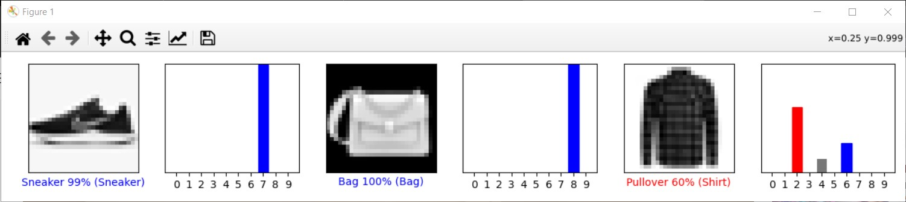

# Lab 10 (Module 11)- TensorFlow

### Checkpoint 1

***TensorFlow Working Example***

### Checkpoint 2

***Images 9000-9014 Result***

### Checkpoint 3

***Images used***
  
  
  
  
  
  

***Result of 3 images from above***

